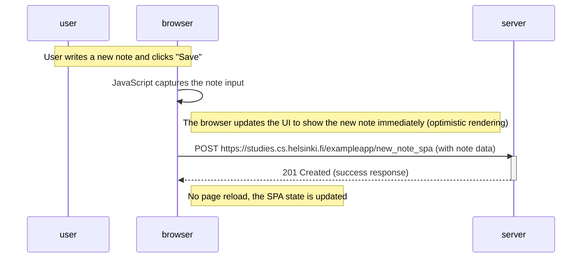

```mermaid
    sequenceDiagram
        participant user
        participant browser
        participant server

        Note over user, browser: User writes a new note and clicks "Save"

        browser->>browser: JavaScript captures the note input
        Note right of browser: The browser updates the UI to show the new note immediately (optimistic rendering)

        browser->>server: POST https://studies.cs.helsinki.fi/exampleapp/new_note_spa (with note data)
        activate server
        server-->>browser: 201 Created (success response)
        deactivate server

        Note right of browser: No page reload, the SPA state is updated
```